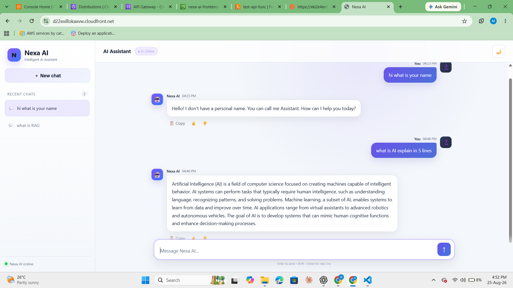
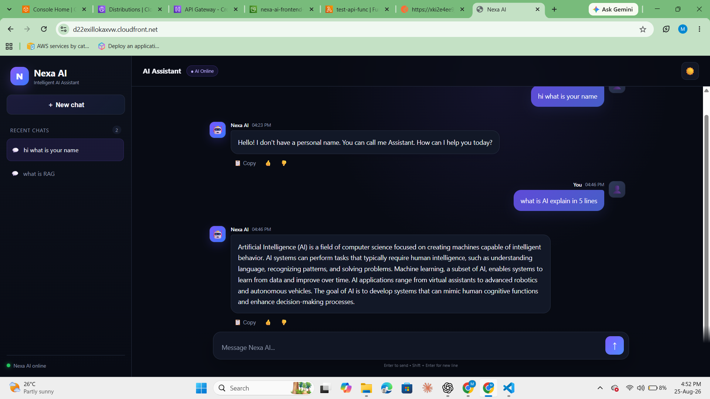
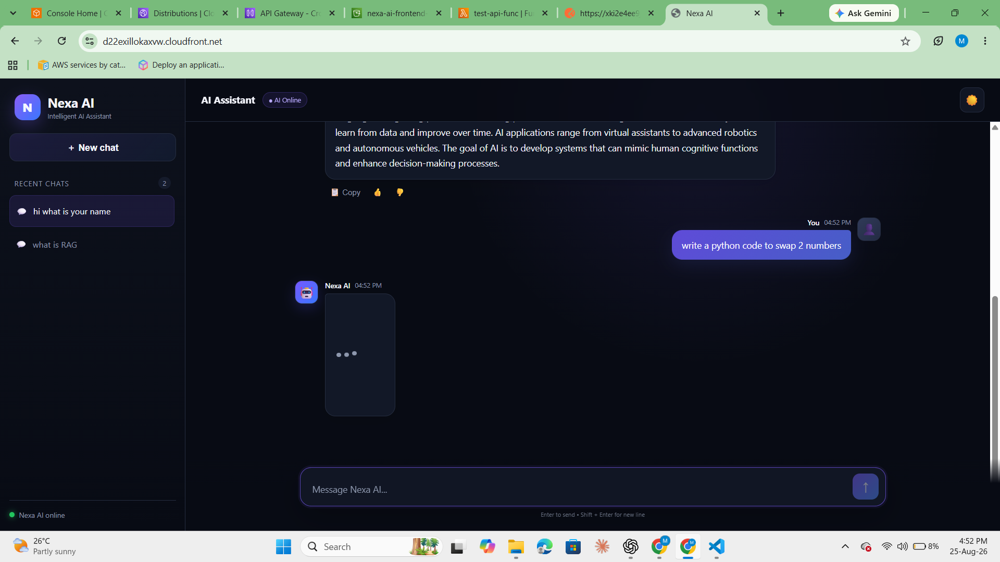
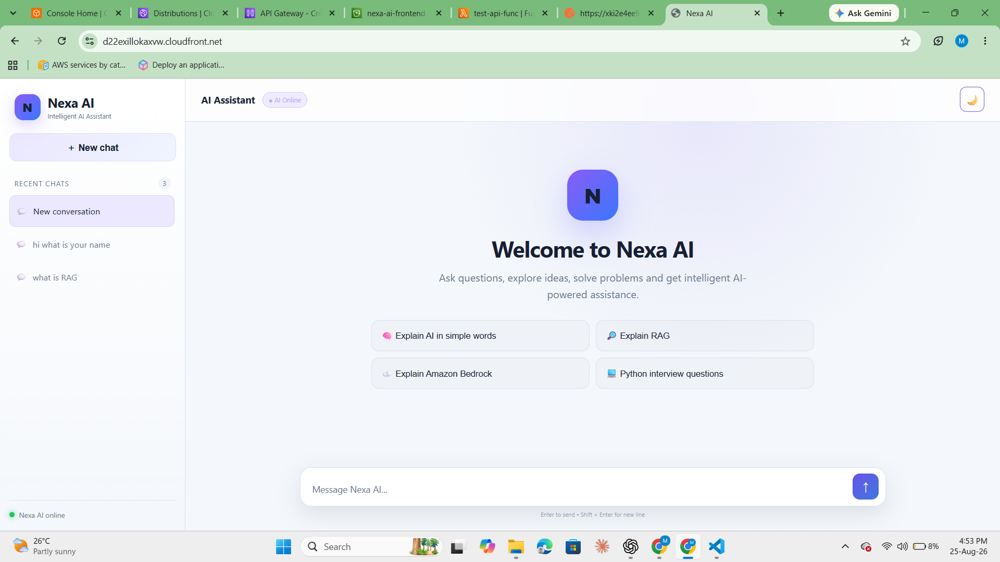

# 🤖 Nexa AI

## 🖼️ Screenshots

### 🌐 Application


### 🌙 Dark Mode


### 💬 Chat Interface


### ☁️ AWS Deployment


------------------------------------------------------------------------

## ✨ Overview

**Nexa AI** is a modern AI chatbot application built with a serverless
AWS architecture.

The project demonstrates an end-to-end deployment using **Amazon S3,
CloudFront, API Gateway and AWS Lambda**, with the frontend delivered
through CloudFront and the backend exposed through an API endpoint.

------------------------------------------------------------------------

## 🚀 Features

-   💬 AI-powered chat interface
-   🗂️ Recent chat history
-   📝 Conversation-based chat titles
-   📱 Responsive modern UI
-   ⚡ Serverless AWS deployment
-   🔐 CloudFront + S3 frontend delivery

------------------------------------------------------------------------

# 🏗️ Architecture

```text
                              ┌──────────────────────┐
                              │    👤 User / Browser  │
                              └───────────┬──────────┘
                                          │
                         ┌────────────────┴────────────────┐
                         │                                 │
                         ▼                                 ▼
              ┌─────────────────────┐          ┌─────────────────────┐
              │   ☁️ CloudFront     │          │   🚀 API Gateway    │
              │        CDN          │          │     POST /chat      │
              └──────────┬──────────┘          └──────────┬──────────┘
                         │                                │
                         ▼                                ▼
              ┌─────────────────────┐          ┌─────────────────────┐
              │     🪣 Amazon S3    │          │      FastAPI        │
              │    Nexa AI UI       │          │   API Application   │
              └─────────────────────┘          └──────────┬──────────┘
                                                         │
                                                         ▼
                                              ┌─────────────────────┐
                                              │    ⚡ AWS Lambda     │
                                              │                      │
                                              │      LangGraph       │
                                              │    Agent Workflow    │
                                              └──────────┬──────────┘
                                                         │
                                                         ▼
                                              ┌─────────────────────┐
                                              │      🤖 LLM          │
                                              │  Response Generation │
                                              └──────────┬──────────┘
                                                         │
                                                         │ AI Response
                                                         ▼
                                              ┌─────────────────────┐
                                              │     API Gateway     │
                                              │       /chat         │
                                              └──────────┬──────────┘
                                                         │
                                                         ▼
                                                  👤 User / Browser
```

------------------------------------------------------------------------

# ☁️ AWS Services

  Service                  Purpose
  ------------------------ ----------------------------------------------
  **Amazon S3**            Stores and serves the static frontend origin
  **Amazon CloudFront**    CDN and HTTPS delivery for the frontend
  **Amazon API Gateway**   Exposes the `/chat` API
  **AWS Lambda**           Runs the Python backend
  **Amazon CloudWatch**    Lambda logs and monitoring
  **AWS IAM**              Permissions for AWS resources

------------------------------------------------------------------------

# 📁 Project Structure

``` text
Nexa-AI/
│
├── frontend/
│   └── index.html
│
├── backend/
│   ├── main.py
│   ├── requirements.txt
│   └── package/
│
└── README.md
```

------------------------------------------------------------------------

# 🚀 Deployment Guide

### 0️⃣ Clone the Repository

```bash
git clone https://github.com/musaddiq-vd/langgraph.git
cd langgraph
cd Nexa AI
```

After cloning, choose a deployment method:

- [⚙️ Automatic Deployment (AWS CDK)](#automatic-deployment-aws-cdk)
- [🛠️ Manual Deployment](#manual-deployment)

---

## ⚙️ Automatic Deployment (AWS CDK)

Deploy the complete Nexa AI infrastructure using **AWS CDK**.

### Steps

```bash
cd infrastructure
.venv\\Scripts\\activate
cdk bootstrap
cdk deploy
```

CDK deploys the required **S3, CloudFront, API Gateway and Lambda** resources automatically.

> ⚠️ **API Endpoint:** After deployment, API Gateway may generate a new endpoint. Update `API_URL` in `frontend/index.html` with the new `/chat` endpoint, then redeploy the frontend if required.

---

### 🗑️ Cleanup / Delete Resources

After testing, you can delete the deployed AWS resources to avoid unnecessary charges.

From the `infrastructure` directory, run:

```bash
cdk destroy

Confirm with y.

This deletes the CDK/CloudFormation stack and the resources managed by it.

⚠️ Some resources may be retained depending on their removal policy. Check the AWS Console if anything remains.

```

## 🛠️ Manual Deployment

This section describes the **direct AWS deployment process** used for
Nexa AI.

No local-development or local-testing steps are required for deployment.
```
------------------------------------------------------------------------


## 1️⃣ Prepare the Frontend

Place the final production frontend inside:

``` text
frontend/
└── index.html
```

The frontend should contain the API Gateway endpoint used by the
application.

Example:

``` javascript
const API_URL =
  "https://<api-id>.execute-api.<region>.amazonaws.com/chat";
```

------------------------------------------------------------------------

# 2️⃣ Prepare the Lambda Backend

The backend contains the Python application and its required
dependencies.

Example structure:

``` text
backend/
├── main.py
├── requirements.txt
└── package/
```

Install the dependencies into the deployment package:

``` bash
pip install -r requirements.txt -t package/
```

Then place the Lambda Python file inside the package:

``` text
package/
├── main.py
├── <dependencies>
└── ...
```

Create the deployment ZIP from the **contents** of `package/`:

``` bash
cd package
zip -r ../lambda.zip .
```

> The ZIP must contain `main.py` and the installed dependencies at the
> root of the archive.

------------------------------------------------------------------------

# 3️⃣ Create the IAM Role for Lambda

Go to:

**AWS Console → IAM → Roles → Create role**

Select:

``` text
Trusted entity:
AWS service

Use case:
Lambda
```

Attach the required permissions.

For basic execution and CloudWatch logging:

``` text
AWSLambdaBasicExecutionRole
```

If the Lambda calls other AWS services, attach only the additional
permissions actually required by the application.

Example:

``` text
Lambda
 ├── CloudWatch Logs
 ├── Bedrock
 └── Other required AWS services
```

Follow the principle of least privilege for production deployments.

------------------------------------------------------------------------

# 4️⃣ Create the Lambda Function

Go to:

**AWS Console → Lambda → Create function**

Select:

``` text
Author from scratch
```

Configure:

``` text
Function name:
test-api-func

Runtime:
Python 3.x

Architecture:
x86_64
```

Select the IAM role created previously.

Create the function.

------------------------------------------------------------------------

# 5️⃣ Upload the Lambda Deployment Package

Open the Lambda function:

**Code → Upload from → Amazon S3**

Upload:

``` text
lambda.zip
```

to an S3 bucket.

Example S3 object:

``` text
s3://<bucket-name>/lambda.zip
```

Then configure Lambda:

``` text
Code source
→ Upload from
→ Amazon S3
```

Enter the S3 object location and update the function.

### Important

Large Lambda deployment packages may exceed the direct console ZIP
upload limit.

For larger packages, use:

``` text
S3 → Lambda
```

instead of uploading the ZIP directly from the browser.

------------------------------------------------------------------------

# 6️⃣ Configure Lambda Handler

Go to:

**Lambda → Configuration → Runtime settings**

Set the handler according to the Python file and handler function.

For example, if the file contains:

``` text
main.py
```

and the Lambda entry function is:

``` python
lambda_handler
```

configure:

``` text
Handler:
main.lambda_handler
```

If the application uses a framework adapter, configure the handler
required by that adapter.

------------------------------------------------------------------------

# 7️⃣ Configure Lambda Memory and Timeout

Go to:

**Lambda → Configuration → General configuration**

Recommended starting configuration:

``` text
Memory:
512 MB or higher

Timeout:
30–60 seconds
```

Adjust these values according to the AI model response time and
dependency requirements.

For production workloads, monitor:

-   Duration
-   Errors
-   Throttles
-   Memory usage

------------------------------------------------------------------------

# 8️⃣ Create API Gateway

Go to:

**AWS Console → API Gateway → Create API**

For this project, create:

``` text
HTTP API
```

Name:

``` text
lambda-fastapi
```

------------------------------------------------------------------------

# 9️⃣ Configure API Gateway Route

Create the route:

``` text
POST /chat
```

Integration target:

``` text
test-api-func
```

Architecture:

``` text
POST /chat
      ↓
API Gateway
      ↓
Lambda
```

The API Gateway endpoint will look similar to:

``` text
https://<api-id>.execute-api.<region>.amazonaws.com/chat
```

------------------------------------------------------------------------

# 🔟 Configure CORS

Go to:

**API Gateway → Your API → CORS**

For the frontend deployment, configure the required origin.

For initial deployment:

``` text
Allowed Origin:
*
```

Allowed methods:

``` text
POST
OPTIONS
```

Allowed headers:

``` text
content-type
```

Example:

``` text
Access-Control-Allow-Origin: *
Access-Control-Allow-Methods: POST, OPTIONS
Access-Control-Allow-Headers: content-type
```

### Production recommendation

After deployment, replace `*` with the actual CloudFront domain:

``` text
https://<cloudfront-domain>.cloudfront.net
```

This restricts browser requests to the deployed frontend origin.

------------------------------------------------------------------------

# 1️⃣1️⃣ Deploy API Gateway

After configuring the API:

``` text
API Gateway
→ Deploy
```

Use the default stage if appropriate.

Make sure the deployed route is:

``` text
POST /chat
```

------------------------------------------------------------------------

# 1️⃣2️⃣ Create S3 Bucket for Frontend

Go to:

**AWS Console → S3 → Create bucket**

Example:

``` text
nexa-ai-frontend-2026
```

Keep the bucket private when using CloudFront Origin Access Control.

------------------------------------------------------------------------

# 1️⃣3️⃣ Upload Frontend to S3

Upload:

``` text
frontend/index.html
```

to the root of the bucket:

``` text
s3://nexa-ai-frontend-2026/index.html
```

The final structure should be:

``` text
nexa-ai-frontend-2026/
└── index.html
```

------------------------------------------------------------------------

# 1️⃣4️⃣ Create CloudFront Distribution

Go to:

**AWS Console → CloudFront → Create distribution**

Configure the S3 origin:

``` text
Origin:
nexa-ai-frontend-2026.s3.<region>.amazonaws.com
```

Enable:

``` text
Origin Access Control (OAC)
```

Create/select an OAC.

Recommended signing behavior:

``` text
Sign requests
```

This allows CloudFront to securely access the private S3 origin.

------------------------------------------------------------------------

# 1️⃣5️⃣ Configure CloudFront Default Root Object

Set:

``` text
Default root object:
index.html
```

This allows the CloudFront root URL to automatically serve:

``` text
/index.html
```

------------------------------------------------------------------------

# 1️⃣6️⃣ Configure CloudFront

Recommended initial settings:

``` text
Origin Shield:
Disabled

Cache:
Default S3 cache settings

Security protections:
Enabled
```

Create the distribution.

CloudFront will provide a domain similar to:

``` text
https://xxxxxxxxxxxx.cloudfront.net
```

------------------------------------------------------------------------

# 1️⃣7️⃣ Update S3 Bucket Policy for CloudFront

When using OAC, CloudFront needs permission to read the S3 objects.

AWS may provide an automatic option to update the S3 bucket policy.

Allow the CloudFront distribution to access:

``` text
s3://nexa-ai-frontend-2026/*
```

Do **not** make the S3 bucket publicly readable when using OAC.

------------------------------------------------------------------------

# 1️⃣8️⃣ Update API CORS with CloudFront Domain

After CloudFront is created, use the actual CloudFront domain:

``` text
https://xxxxxxxxxxxx.cloudfront.net
```

Update API Gateway CORS:

``` text
Allowed Origin:
https://xxxxxxxxxxxx.cloudfront.net
```

Keep:

``` text
POST
OPTIONS
```

and:

``` text
content-type
```

as required headers/methods.

------------------------------------------------------------------------

# 1️⃣9️⃣ Update Frontend API URL

The frontend must call the deployed API Gateway endpoint.

Inside `frontend/index.html`:

``` javascript
const API_URL =
  "https://<api-id>.execute-api.<region>.amazonaws.com/chat";
```

Upload the updated `index.html` to S3.

------------------------------------------------------------------------

# 2️⃣0️⃣ Invalidate CloudFront Cache

After updating the frontend:

Go to:

**CloudFront → Distribution → Invalidations → Create invalidation**

Use:

``` text
/*
```

This forces CloudFront to retrieve the updated frontend from S3.

------------------------------------------------------------------------

# 2️⃣1️⃣ Final Production Architecture

After deployment, the complete application looks like:

``` text
                         INTERNET
                            │
                            ▼
                    ┌────────────────┐
                    │   CloudFront   │
                    │      CDN       │
                    └───────┬────────┘
                            │
                            ▼
                    ┌────────────────┐
                    │       S3       │
                    │  Nexa AI UI    │
                    └────────────────┘


        User sends chat message
                 │
                 ▼
        ┌──────────────────┐
        │   API Gateway    │
        │    POST /chat    │
        └────────┬─────────┘
                 │
                 ▼
        ┌──────────────────┐
        │   AWS Lambda     │
        │  Python Backend  │
        └────────┬─────────┘
                 │
                 ▼
        ┌──────────────────┐
        │   AI Agent/LLM   │
        └──────────────────┘
```

------------------------------------------------------------------------

# 🔄 Request Flow

``` text
Browser
   ↓
CloudFront
   ↓
S3
   ↓
Nexa AI Frontend
   ↓
API Gateway
   ↓
Lambda
   ↓
AI Agent / LLM
   ↓
Lambda
   ↓
API Gateway
   ↓
Frontend
   ↓
User
```

------------------------------------------------------------------------

# 🧪 API Format

### Request

``` http
POST /chat
Content-Type: application/json
```

``` json
{
  "message": "What is RAG?"
}
```

### Response

``` json
{
  "response": "RAG stands for Retrieval-Augmented Generation..."
}
```

------------------------------------------------------------------------

# 🔐 Production Security Recommendations

For a production environment, consider adding:

-   🔑 Amazon Cognito authentication
-   🪪 JWT authorization
-   🛡️ AWS WAF
-   🚦 API Gateway throttling
-   🔐 AWS Secrets Manager
-   📊 CloudWatch alarms
-   🔒 Private S3 bucket + CloudFront OAC
-   🌐 Custom domain
-   🔐 HTTPS
-   🧩 IAM least-privilege policies
-   📈 Cost monitoring and AWS Budgets

------------------------------------------------------------------------

# 📈 Future Improvements

-   [ ] Amazon Cognito authentication
-   [ ] Persistent chat history with DynamoDB
-   [ ] Streaming AI responses
-   [ ] File upload
-   [ ] Amazon Bedrock Knowledge Bases
-   [ ] OpenSearch vector search
-   [ ] RAG pipeline
-   [ ] Conversation search
-   [ ] User profiles
-   [ ] CloudWatch dashboards
-   [ ] AWS WAF
-   [ ] Custom domain
-   [ ] CI/CD using GitHub Actions

------------------------------------------------------------------------

# 🎯 What This Project Demonstrates

-   AWS serverless architecture
-   Amazon S3
-   Amazon CloudFront
-   API Gateway
-   AWS Lambda
-   IAM
-   CORS
-   REST APIs
-   Python backend
-   AI/LLM integration
-   Frontend-backend integration
-   Cloud deployment
-   CDN-based application delivery
-   Production deployment concepts

------------------------------------------------------------------------

# 👨‍💻 Author

**Musaddiq Khan**

GenAI Engineer \| Python \| AWS \| Generative AI \| RAG \| LangChain \|
LangGraph

------------------------------------------------------------------------

```{=html}
<p align="center">
```
⭐ If you find this project useful, consider giving it a star!
```{=html}
</p>
```
